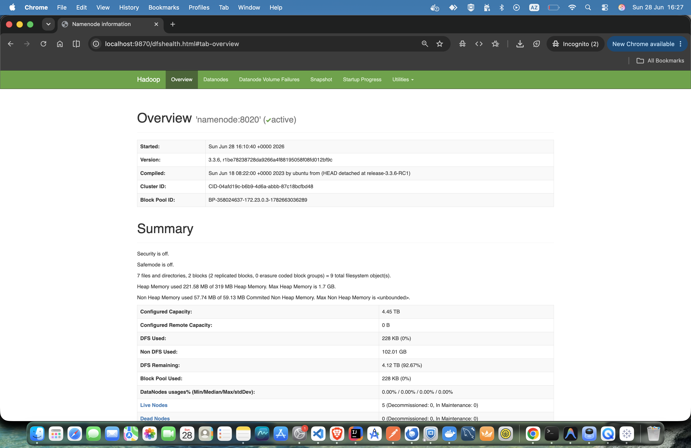
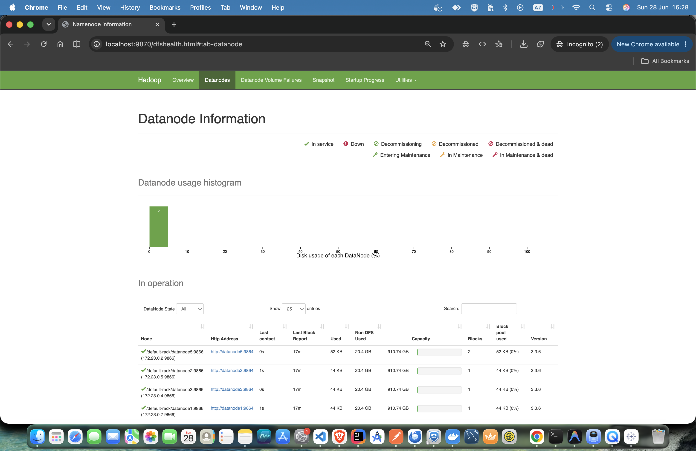
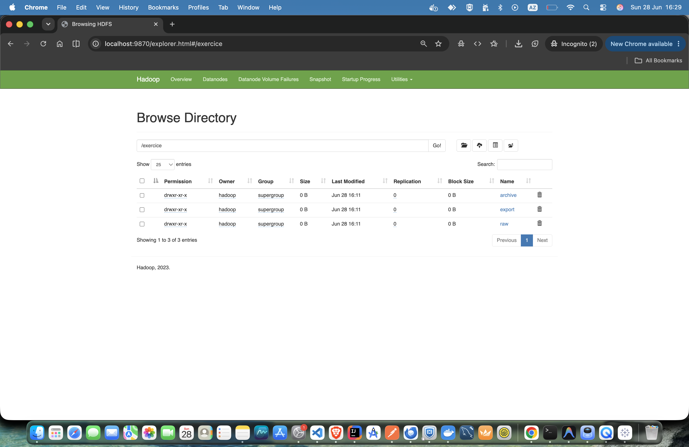

# TP Big Data — Exercice de synthèse HDFS

Cluster Hadoop HDFS avec Docker Compose : 1 NameNode + 5 DataNodes.

## Structure

```
.
├── docker-compose.yml
├── config
├── volumes/
├── captures/
│   ├── overview.png
│   ├── datanodes.png
│   └── utilities-filesystem.png
└── README.md
```

## 1. Lancement du cluster

```bash
docker compose up -d
docker compose ps
docker compose logs namenode   # Attendre "NameNode RPC server is ready"
```

## 2. Connexion au NameNode

```bash
docker compose exec namenode bash
```

## Exercice de synthèse

### Commandes

```bash
# 1. Créer le dossier /exercice
hdfs dfs -mkdir /exercice

# 2. Créer les sous-dossiers
hdfs dfs -mkdir /exercice/raw
hdfs dfs -mkdir /exercice/archive
hdfs dfs -mkdir /exercice/export

# 3. Créer clients.csv localement
cat > /tmp/clients.csv << 'EOF'
id_client,nom,ville,pays
1,Ahmed,Casablanca,Maroc
2,Fatima,Rabat,Maroc
3,Youssef,Fes,Maroc
4,Sara,Marrakech,Maroc
EOF

# 4. Envoyer clients.csv dans /exercice/raw
hdfs dfs -put /tmp/clients.csv /exercice/raw/

# 5. Lire le fichier depuis HDFS
hdfs dfs -cat /exercice/raw/clients.csv

# 6. Copier le fichier vers /exercice/archive
hdfs dfs -cp /exercice/raw/clients.csv /exercice/archive/

# 7. Télécharger depuis HDFS vers le système local
hdfs dfs -get /exercice/raw/clients.csv /tmp/export/

# 8. Afficher la taille du fichier
hdfs dfs -du -h /exercice/raw/clients.csv

# 9. Vérifier les blocs du fichier
hdfs fsck /exercice/raw/clients.csv -files -blocks -locations

# 10. Modifier le facteur de réplication à 3
hdfs dfs -setrep -w 3 /exercice/raw/clients.csv
```

### 2. Capture de l'interface web du NameNode





### 3. Résultat de `hdfs dfs -ls -R /exercice`

```
bash-4.2$ hdfs dfs -ls -R /exercice
drwxr-xr-x   - hadoop supergroup          0 2026-06-28 16:11 /exercice/archive
-rw-r--r--   3 hadoop supergroup        114 2026-06-28 16:11 /exercice/archive/clients.csv
drwxr-xr-x   - hadoop supergroup          0 2026-06-28 16:11 /exercice/export
drwxr-xr-x   - hadoop supergroup          0 2026-06-28 16:11 /exercice/raw
-rw-r--r--   3 hadoop supergroup        114 2026-06-28 16:11 /exercice/raw/clients.csv
bash-4.2$
```

### 4. Résultat de `hdfs fsck /exercice/raw/clients.csv -files -blocks -locations`

```
bash-4.2$ hdfs fsck /exercice/raw/clients.csv -files -blocks -locations
Connecting to namenode via http://namenode:9870/fsck?ugi=hadoop&files=1&blocks=1&locations=1&path=%2Fexercice%2Fraw%2Fclients.csv
FSCK started by hadoop (auth:SIMPLE) from /172.23.0.3 for path /exercice/raw/clients.csv at Sun Jun 28 16:25:38 UTC 2026

/exercice/raw/clients.csv 114 bytes, replicated: replication=3, 1 block(s):  OK
0. BP-358024637-172.23.0.3-1782663036289:blk_1073741825_1001 len=114 Live_repl=3  [DatanodeInfoWithStorage[172.23.0.5:9866,DS-94435a5c-6386-46f2-a9a6-83973099d2bf,DISK], DatanodeInfoWithStorage[172.23.0.2:9866,DS-9c9da536-caaa-45da-83f6-270d1fb8c93f,DISK], DatanodeInfoWithStorage[172.23.0.7:9866,DS-4dda53b2-3ad2-4729-b9f7-7425694c1a89,DISK]]


Status: HEALTHY
 Number of data-nodes:  5
 Number of racks:               1
 Total dirs:                    0
 Total symlinks:                0

Replicated Blocks:
 Total size:    114 B
 Total files:   1
 Total blocks (validated):      1 (avg. block size 114 B)
 Minimally replicated blocks:   1 (100.0 %)
 Over-replicated blocks:        0 (0.0 %)
 Under-replicated blocks:       0 (0.0 %)
 Mis-replicated blocks:         0 (0.0 %)
 Default replication factor:    3
 Average block replication:     3.0
 Missing blocks:                0
 Corrupt blocks:                0
 Missing replicas:              0 (0.0 %)
 Blocks queued for replication: 0

Erasure Coded Block Groups:
 Total size:    0 B
 Total files:   0
 Total block groups (validated):        0
 Minimally erasure-coded block groups:  0
 Over-erasure-coded block groups:       0
 Under-erasure-coded block groups:      0
 Unsatisfactory placement block groups: 0
 Average block group size:      0.0
 Missing block groups:          0
 Corrupt block groups:          0
 Missing internal blocks:       0
 Blocks queued for replication: 0
FSCK ended at Sun Jun 28 16:25:38 UTC 2026 in 11 milliseconds


The filesystem under path '/exercice/raw/clients.csv' is HEALTHY
bash-4.2$ 
```

### 5. Rôle de la réplication

La réplication dans HDFS consiste à dupliquer chaque bloc de données sur plusieurs DataNodes distincts (facteur par défaut = 3). Elle remplit deux objectifs :

- **Tolérance aux pannes** : si un DataNode tombe en panne, les données restent accessibles via les copies sur les autres DataNodes. Aucune perte de données ni interruption de service.

- **Disponibilité** : HDFS peut lire un bloc depuis la réplique la plus proche, ce qui améliore le débit et permet à plusieurs lecteurs d'accéder simultanément aux mêmes données via différents DataNodes.

Sans réplication, la panne d'un seul DataNode entraînerait une perte définitive des blocs qu'il hébergeait.
