# TP Big Data — Stockage Objet avec MinIO

## Structure

```
TP2/
├── docker-compose.yml
├── data/
│   ├── ventes.csv
│   ├── clients.json
│   ├── application.log
│   └── produit.txt
├── images/
│   ├── 1-postman-collection-variables.png
│   ├── 2-postman-create-bucket.png
│   ├── 3-postman-put-ventes-csv.png
│   ├── 4-postman-put-clients-json.png
│   ├── 6-postman-put-produit-txt.png
│   ├── 7-postman-put-document-ventes-csv.png
│   ├── 8-postman-get-liste-objets.png
│   ├── 9-postman-get-clients-json.png
│   ├── 10-postman-head-application-log.png
│   ├── 5-postman-put-app-log.png
│   ├── 11.png
│   ├── 12.png
│   └── 13.png
├── Atelier_MinIO_API.postman_collection.json
└── README.md
```

---

## 1. Lancement de MinIO

```bash
docker compose up -d
docker compose ps
```

- **Console web** : http://localhost:9001 (`minioadmin` / `minioadmin123`)
- **API S3** : http://localhost:9000

---

## 2. Configuration Postman

**Importer** → `Atelier_MinIO_API.postman_collection.json`

| Variable | Valeur |
|---|---|
| `endpoint` | `http://localhost:9000` |
| `bucket` | `mini-projet-storage` |

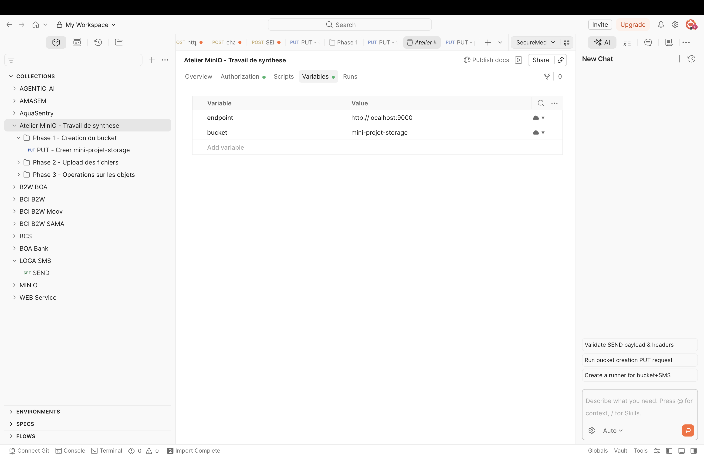

### Authentification AWS Signature (préconfigurée)

| Champ | Valeur |
|---|---|
| Type | AWS Signature |
| Access Key | `minioadmin` |
| Secret Key | `minioadmin123` |
| AWS Region | `us-east-1` |
| Service Name | `s3` |

---

## 3. Travail de synthèse

### 3.1 Contexte

Une entreprise souhaite utiliser MinIO pour stocker différents types de fichiers :
- fichiers de ventes
- fichiers clients
- logs applicatifs
- documents produits
- fichiers divers

L'objectif est de construire une organisation simple dans MinIO, puis de manipuler les objets avec Postman.

### 3.2 Travail demandé

| # | Opération | Méthode | URL dans Postman |
|---|---|---|---|
| 1 | Créer le bucket `mini-projet-storage` | **PUT** | `{{endpoint}}/{{bucket}}` |
| 2 | Déposer `ventes.csv` → `ventes/ventes.csv` | **PUT** | `{{endpoint}}/{{bucket}}/ventes/ventes.csv` |
| 3 | Déposer `clients.json` → `clients/clients.json` | **PUT** | `{{endpoint}}/{{bucket}}/clients/clients.json` |
| 4 | Déposer `application.log` → `logs/application.log` | **PUT** | `{{endpoint}}/{{bucket}}/logs/application.log` |
| 5 | Déposer `produit.txt` → `produits/produit.txt` | **PUT** | `{{endpoint}}/{{bucket}}/produits/produit.txt` |
| 6 | Déposer `ventes.csv` → `documents/ventes.csv` | **PUT** | `{{endpoint}}/{{bucket}}/documents/ventes.csv` |
| 7 | Lister tous les objets du bucket | **GET** | `{{endpoint}}/{{bucket}}?list-type=2` |
| 8 | Télécharger `clients/clients.json` | **GET** | `{{endpoint}}/{{bucket}}/clients/clients.json` |
| 9 | Consulter les métadonnées de `logs/application.log` | **HEAD** | `{{endpoint}}/{{bucket}}/logs/application.log` |
| 10 | Supprimer `produits/produit.txt` | **DELETE** | `{{endpoint}}/{{bucket}}/produits/produit.txt` |
| 11 | Vérifier dans l'interface graphique | — | http://localhost:9001 |

### 3.3 Organisation attendue

```
mini-projet-storage/
├── ventes/ventes.csv
├── clients/clients.json
├── logs/application.log
├── produits/produit.txt
└── documents/ventes.csv
```

### 3.4 Livrables

1. **Capture de la console MinIO** montrant le bucket `mini-projet-storage`
2. **Capture montrant les objets organisés par préfixes**
3. **Capture Postman pour chaque type de requête** (PUT, GET, HEAD, DELETE)
4. **Fichier `docker-compose.yml`**
5. **Courte réponse aux questions de compréhension** (section 4)
6. **Conclusion de 5 à 10 lignes** (section 5)

### 3.5 Captures d'écran

#### Console MinIO — Bucket et préfixes (vérification avant suppression)

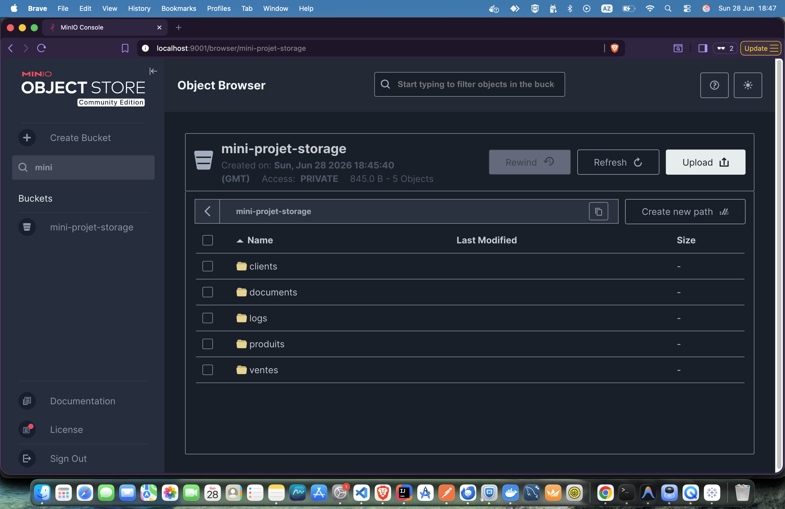

#### Console MinIO — Bucket et préfixes après suppression

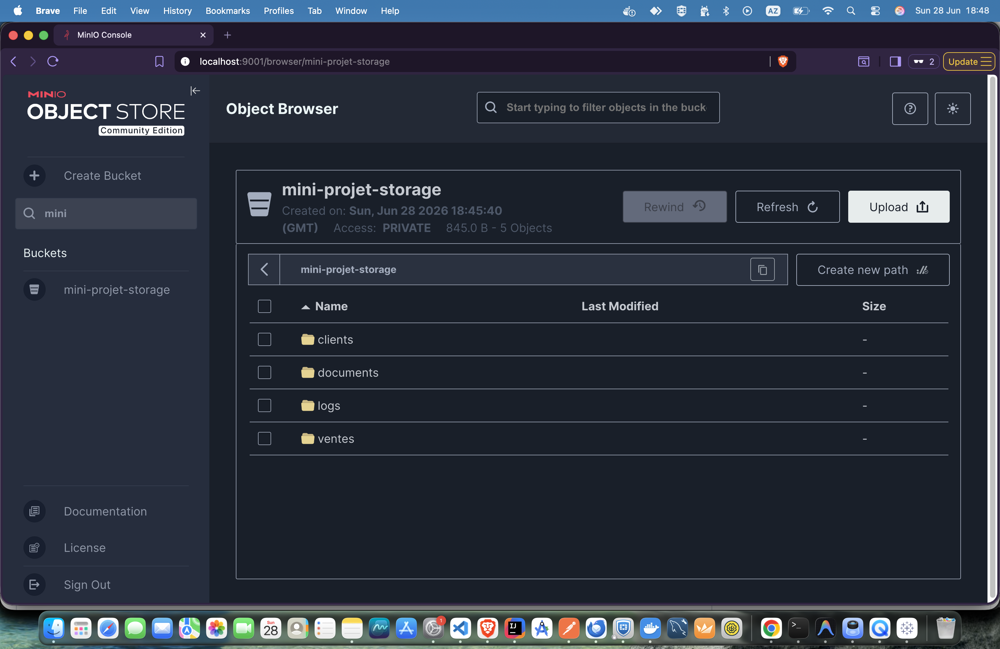

#### Console MinIO — Contenu du préfixe ventes

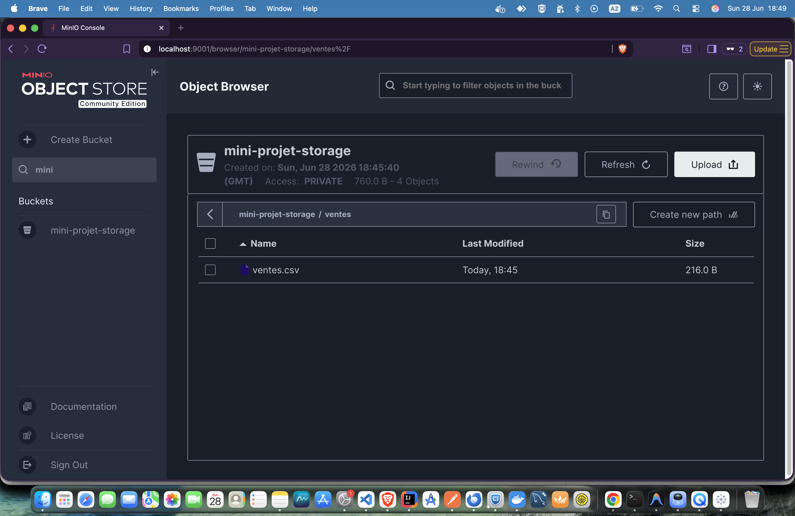

#### Postman — Configuration (variables et auth)


#### Postman — Création du bucket (PUT)

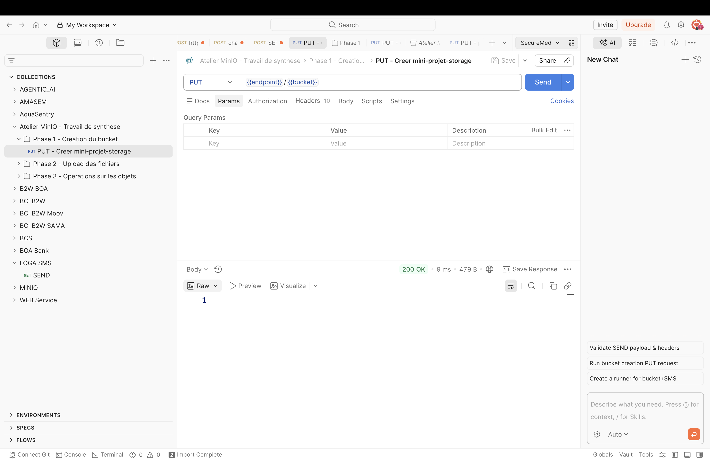

#### Postman — Upload ventes.csv (PUT)

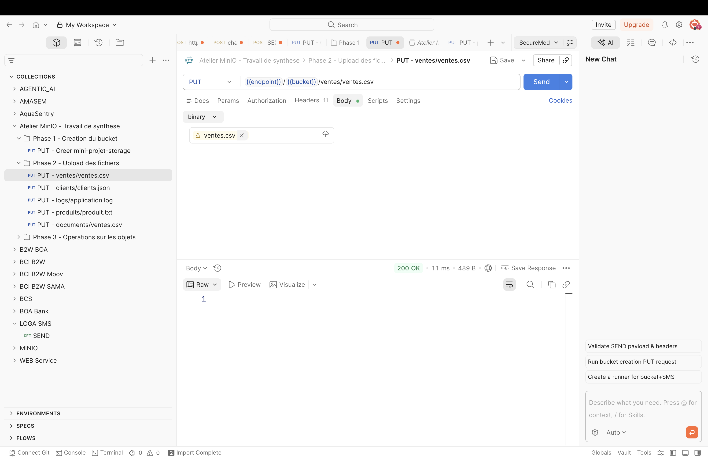

#### Postman — Upload clients.json (PUT)

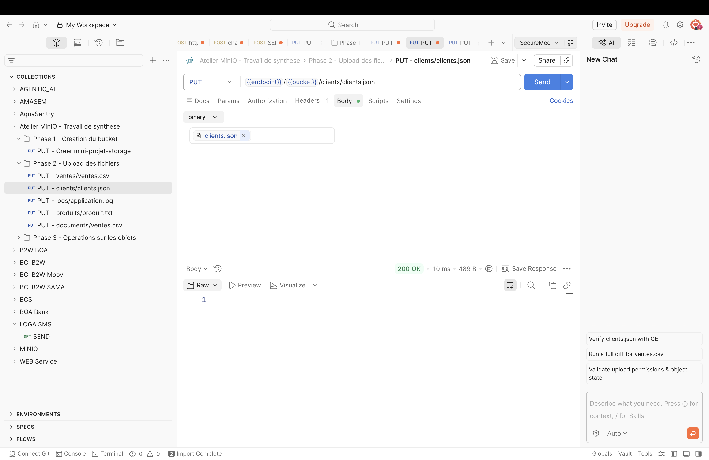

#### Postman — Upload application.log (PUT)

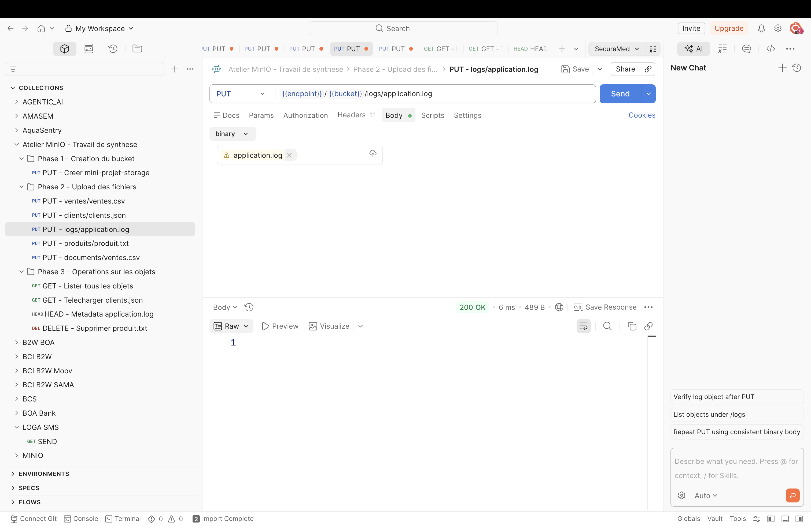

#### Postman — Upload produit.txt (PUT)

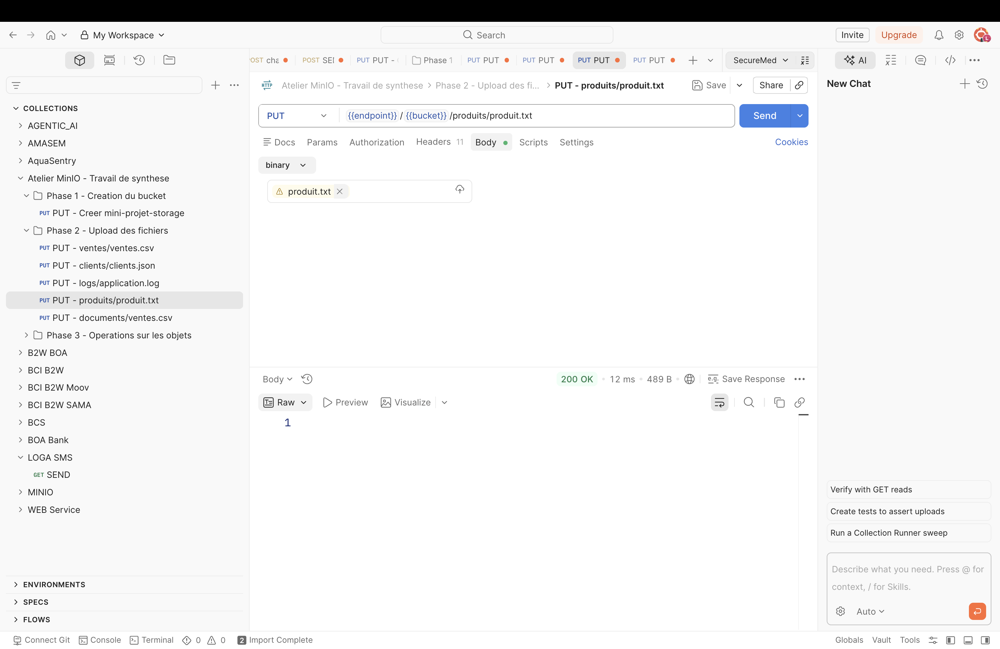

#### Postman — Upload documents/ventes.csv (PUT)

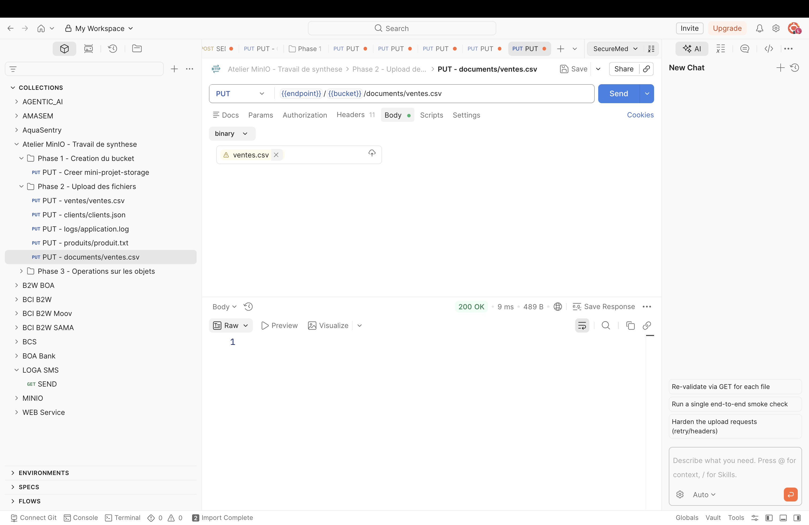

#### Postman — Lister tous les objets (GET)

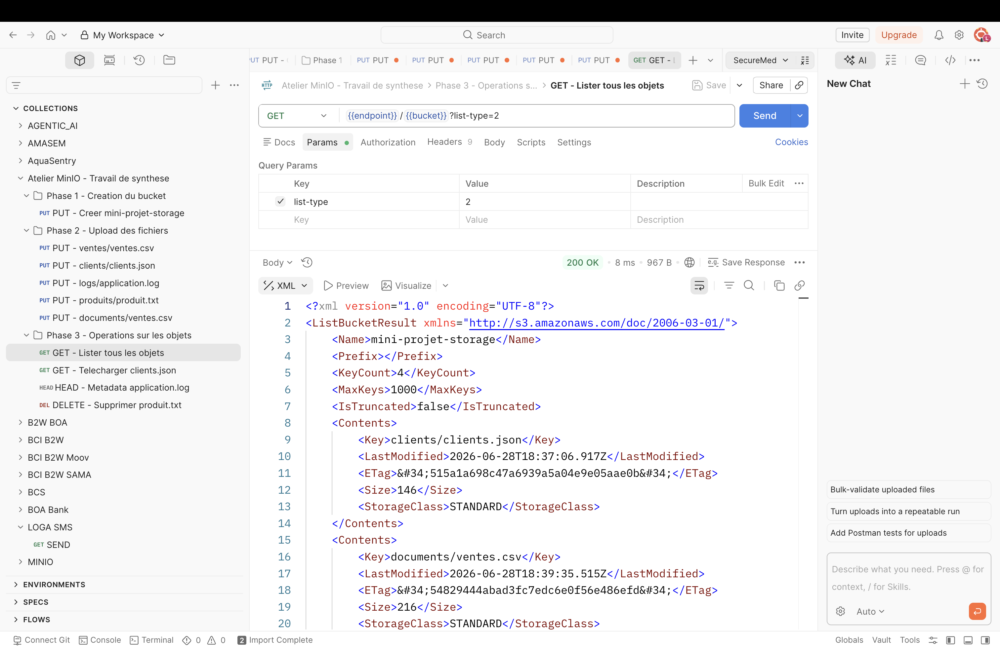

#### Postman — Télécharger clients.json (GET)

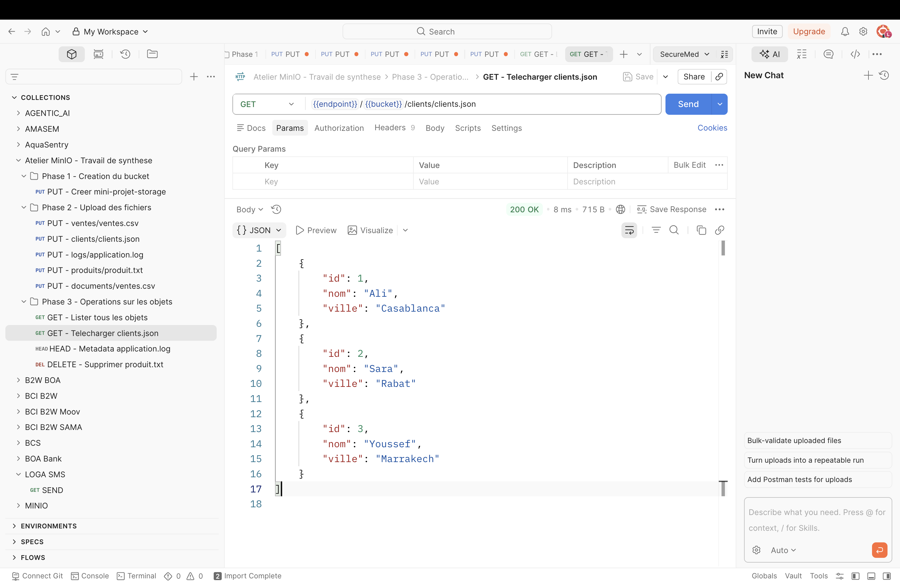

#### Postman — Métadonnées de application.log (HEAD)

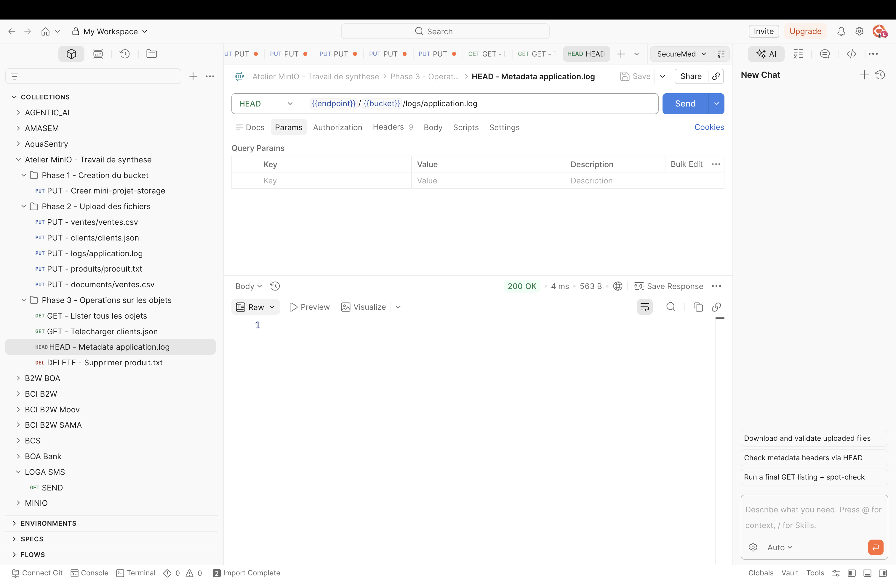

#### Postman — Supprimer produit.txt (DELETE)


---

## 4. Questions de compréhension

### Q1. Quelle est la différence entre un bucket et un dossier ?

Un **bucket** est un conteneur logique au niveau racine du stockage objet. Il possède un nom unique et ses propres politiques d'accès. Un **dossier** est une hiérarchie dans un système de fichiers classique. Dans MinIO, les "dossiers" sont des **préfixes** dans la clé des objets (ex: `ventes/fichier.csv`).

### Q2. Quel est le rôle du port 9000 et du port 9001 ?

- **Port 9000** : API S3 — utilisé par les applications et Postman pour communiquer avec MinIO via REST.
- **Port 9001** : Console web — interface graphique accessible depuis un navigateur.

### Q3. Pourquoi utilise-t-on AWS Signature dans Postman ?

MinIO est compatible avec l'API S3 d'AWS. AWS Signature Version 4 est le mécanisme d'authentification standard d'AWS S3. En l'utilisant, on simule une application qui s'authentifie auprès de MinIO comme avec AWS S3.

### Q4. Quelle est la différence entre HDFS et MinIO ?

| Critère | HDFS | MinIO |
|---|---|---|
| Modèle | Système de fichiers distribué | Stockage objet |
| Unité | Fichier / Bloc | Objet |
| Organisation | Répertoires et fichiers | Buckets et préfixes |
| Accès | Commandes `hdfs dfs` | API REST S3 (HTTP) |
| Interface web | Pas toujours intégrée | Console web intégrée (port 9001) |
| Déploiement | Lourd (écosystème Hadoop) | Léger (un seul conteneur Docker) |
| Cas d'usage | Traitements batch (MapReduce, Spark) | Apps cloud, backups, Data Lakes |

---

## 5. Conclusion (5-10 lignes)

MinIO est une solution de stockage objet légère et compatible S3, facile à déployer avec Docker. Contrairement à HDFS qui organise les données en fichiers et blocs accessibles via des commandes shell, MinIO expose une API REST accessible depuis n'importe quelle application. La console web intégrée permet une gestion visuelle simple des buckets et objets. L'utilisation de Postman montre comment une application interagit avec MinIO via l'API S3 sans écrire de code. Ce TP a démontré que le stockage objet est plus adapté que HDFS pour des cas comme le stockage de fichiers hétérogènes, les backups ou les Data Lakes, tandis que HDFS reste pertinent pour les traitements batch lourds nécessitant un calcul distribué.

---

## 6. Arrêt et nettoyage

```bash
# Arrêter les conteneurs
docker compose down

# Supprimer les conteneurs et le volume (supprime aussi les données)
docker compose down -v
```
